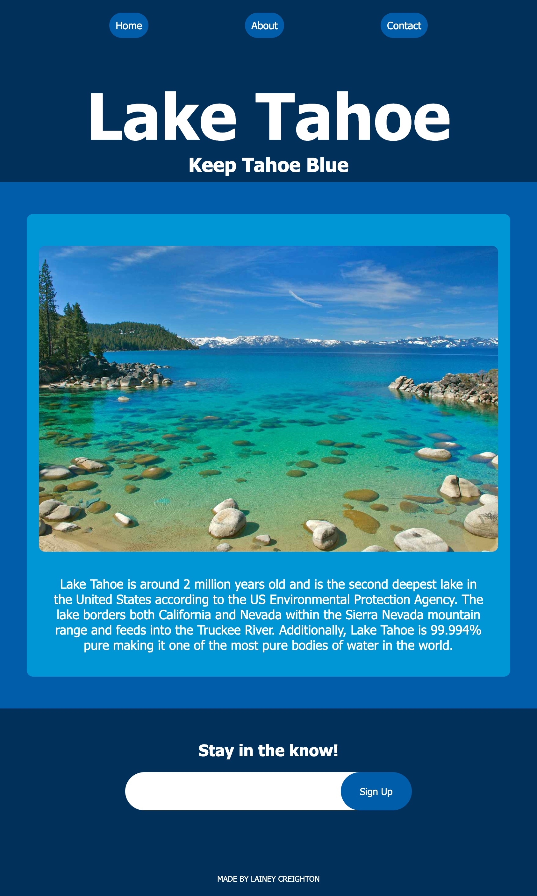

# Landing Page

## Table of Contents
- [Description](#description)
- [Learning Points](#learning-points)
- [Features](#features)
- [Technology Used](#technology-used)
- [Deployment](#deployment)
- [Author](#author)
- [Contributing](#contributing)
- [License](#license)

## Description

This project serves as a demonstration of fundamental HTML and CSS skills through the creation of a mock web application landing page. By developing this landing page from scratch, I aimed to exhibit my grasp of key concepts including semantic elements, form integration, the utilization of classes and IDs, and the practice of thorough code commenting. The page was built entirely without the use of starter code, showcasing my ability to craft a webpage from the ground up.

 

## Learning Points

- How to use flexbox.
- How to create a linked navigation menu.
- How to create forms.
- How to use HTML semantic elements.
- How to use class, id, element, and universal selectors in CSS.

 

## Features

- **Semantic Elements:** The landing page employs a variety of semantic HTML elements to enhance the structure and accessibility of the content.

- **Form Integration:** A functional form is integrated, demonstrating the ability to capture user input and process it using HTML forms.

- **CSS Styling:** The page is styled using CSS, with classes and IDs used for precise targeting of elements and styling enhancements.

- **Code Comments:** Throughout the HTML and CSS files, you'll find comprehensive comments detailing the purpose and functionality of different sections of code.

 

## Technology Used

 

 

| Technology Used | Resource URL                                                      |
| --------------- | ----------------------------------------------------------------- |
| HTML Semantic Elements | [https://www.w3schools.com/html/html5_semantic_elements.asp](https://www.w3schools.com/html/html5_semantic_elements.asp) |
| HTML input Tag | [https://www.w3schools.com/tags/tag_input.asp](https://www.w3schools.com/tags/tag_input.asp) |
| A Complete Guide to Flexbox | [https://css-tricks.com/snippets/css/a-guide-to-flexbox/](https://css-tricks.com/snippets/css/a-guide-to-flexbox/) |

 

## Deployment

Website URL: [Lake Tahoe](https://laineycreighton.github.io/landing-page/)

 

## Author

### Lainey Creighton

_Currently a student in the UC Berkeley Full Stack Coding Bootcamp. Contact Below:_

 

 

[dev.lainey@gmail.com](dev.lainey@gmail.com)
 
 

 

[https://www.linkedin.com/in/lainey-creighton/](https://www.linkedin.com/in/lainey-creighton/)
 
 

 

[https://github.com/laineycreighton](https://github.com/laineycreighton)

 

## Contributing

Thank you for your interest in contributing to the Lake Tahoe Landing Page project! While this project is primarily intended to showcase my HTML and CSS skills, contributions and suggestions are welcome.

 

### Reporting Issues

If you find any issues or have suggestions for improvements, please feel free to open an issue in the [issue tracker](link-to-issue-tracker). Provide as much detail as possible, including steps to reproduce the problem.

 

### Pull Requests

If you'd like to contribute code to this project, you can follow these general steps:

1. Fork the repository.
2. Create a new branch for your contribution: `git checkout -b feature/new-feature`.
3. Make your changes and commit them: `git commit -m 'Add new feature'`.
4. Push your changes to your fork: `git push origin feature/new-feature`.
5. Open a pull request against the `main` branch of this repository.

Please ensure that your code follows best practices and is well-documented. Also, make sure to keep your pull request focused and limited to a single feature or improvement.

 

### Code Style

While there are no strict guidelines for code style in this project, please try to maintain consistency with the existing codebase. Use meaningful variable names and add comments where necessary to explain complex logic.

 

### Code of Conduct

Please note that this project follows the [Contributor Covenant Code of Conduct](link-to-code-of-conduct). By participating, you are expected to uphold this code. Please report any unacceptable behavior.

Thank you for considering contributing to the Lake Tahoe Landing Page project! Your input is valued.

 

## License

N/A